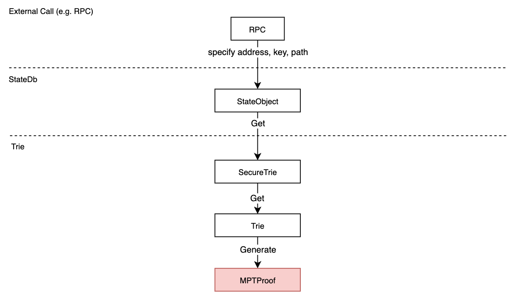

# Estimate Witness

In the State Expiry, the state without access for more than about 1 year is temporarily marked as expired, and ReviveStateTx+Witness must be used to revive the state.

  

This is how to provide users with a better user experience is the key. BSC has a built-in Estimate Witness capability. Currently, this service is generally provided in Archive Node, and will be explored in GreenField later.

  

The positioning of Estimate Witness is like the previous EstimateGas, which allows users to estimate the witness and gas required before initiating a transaction. This involves the generation of witnesses and the calculation of the minimum Gas.

Estimate Witness will be provided in RPC API, which greatly improves user experience.

