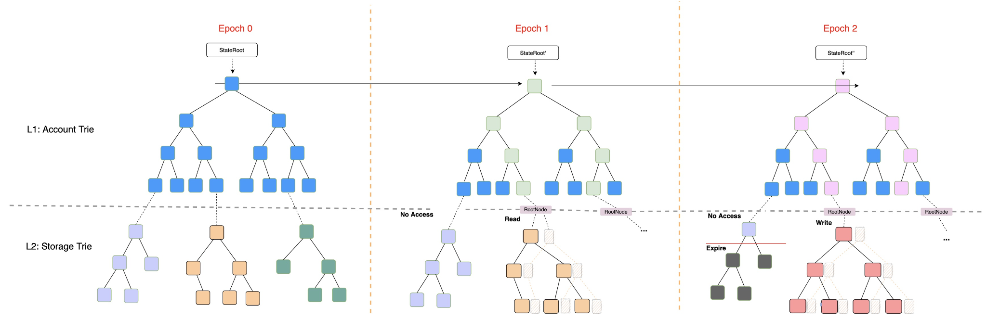

# Introduction

As part of the BSC community, NodeReal has proposed a state expiry scheme for BSC, aiming to reduce node storage requirements and increase overall decentralization. The state expiry scheme works in a way such that the expired storage state is removed from the blockchain, but can be revived by users through a new type of transaction. The development team has also built a Proof-of-Concept (POC), showing up to 89% reduction in storage trie size.

## BSC's State Expiry Proposal

For the state expiry proposal, two BEPs have been proposed — BEP-206 and BEP-215.

### BEP-206

Proposal: [https://github.com/bnb-chain/BEPs/pull/206](https://github.com/bnb-chain/BEPs/pull/206)

BEP-206 proposes a hybrid mode state expiry with the addition of Shadow Tree and epoch in the storage tree. The expiry mechanism only works on storage state data (i.e. it will not affect EOA). The Shadow Tree is used to store the access record for the MPT tree, such that all untouched states in the last 2 epochs will expire. <!--More technical details can be found in Private ([https://app.clickup.com/25652588/docs/revbc-25105/revbc-121925](https://app.clickup.com/25652588/docs/revbc-25105/revbc-121925))-->
  

### BEP-215

Proposal: [https://github.com/bnb-chain/BEPs/pull/215](https://github.com/bnb-chain/BEPs/pull/215)

BEP-215 proposes a new transaction type to support BEP-206. The new transaction type allows the ability to revive a storage state and execute as usual in the same transaction. <!--More technical details can be found in Private ([https://app.clickup.com/25652588/docs/revbc-25105/revbc-123605](https://app.clickup.com/25652588/docs/revbc-25105/revbc-123605))-->

  

### ChangeLog

* **2023-01-18:** First iteration of the state expiry proposal
* **2023-02-23:** Second iteration of the state expiry proposal
* **2023-03-21:** Third iteration of the state expiry proposal
* **2023-03-22:** Development of state expiry POC begins
* **2023-05-15:** Development of POC is concluded and shared within the internal teams
* **2023-06-13:** Researching on Verkle Tree and how it can be integrated into BEP-206