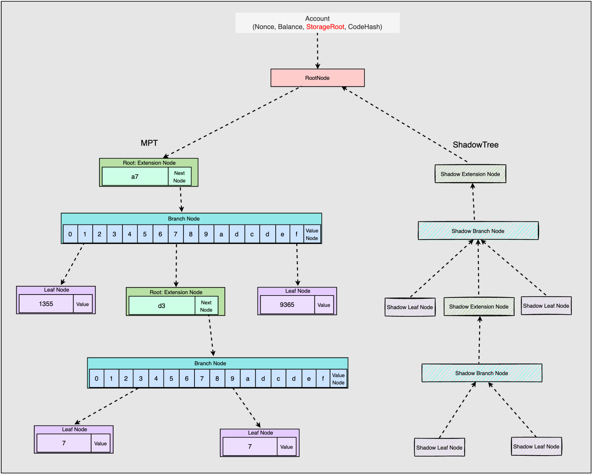
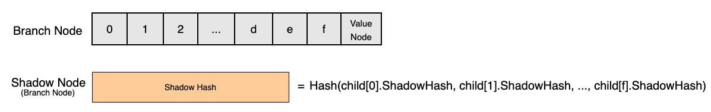
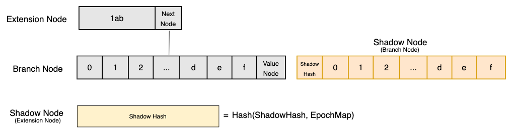
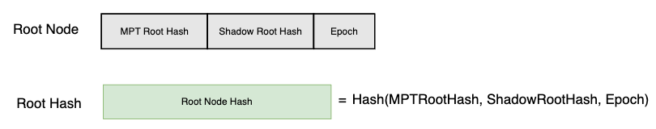

# MPT & Shadow Tree

### New Storage Trie Structure

During Epoch 0, the storage trie stays unchanged. At the start of Epoch 1, the storage trie will be modified to include both MPT and Shadow Tree. The MPT structure is the same as before and the Shadow Tree is the metadata layer to represent the expiry status of the MPT for each node.

  

  

When Shadow Tree is introduced, the storage trie has a new trie node type as its root called RootNode. RootNode consists of 3 fields:

*   **EpochIndex**: the latest epoch index in which the trie is accessed
*   **MPT Root**: same as the current MPT Root, it will pointer to the root trie node.
*   **Shadow Root**: the root hash of the shadow tree, which is used to record the access history of the storage trie

  

### Storage Trie R&W

The following flow chart shows how a value can be accessed in a storage trie:

Nodes are traversed until we reach a value node, which indicates that the value for a storage slot key is found. During the traverse process, we will check the expiry status of a child node when reached a full node. A node is considered expired if the current epoch is greater than or equal to 2, and the difference between the node epoch and the current epoch is at least 2.

  

If we come across an expired node when reading or writing a storage slot, an `ExpiredNodeError` is returned.

  

### Shadow Hash

**ShadowBranchNode**

The hash of a ShadowBranchNode is calculated by taking all of the corresponding BranchNode's child nodes' shadow hash values and hashing them together.

  

**ShadowExtensionNode**

If an ExtensionNode's child node is a BranchNode, then its corresponding ShadowExtensionNode's hash value is calculated by hashing the hash of ShadowBranchNode's hash value and ShadowBranchNode's epoch map.

  

If an ExtensionNode's child node is a LeafNode, then its corresponding ShadowExtensionNode's hash value is the hash of a nil value.

  

#### RootHash

The hash value of a RootNode is calculated by hashing the MPTRootHash, ShadowRootHash, and Epoch. The hash value will then be stored as the account's storage root hash.

## ShadowTree Database

ShadowTree must use a `Path-based scheme`, and cannot use a `Hash-based scheme`.

The storage of the shadow node borrows from the archive model of snapshot and erigon.

1. DiffLayers, similar to Snap's diffLayer, records all update records of a block, links the diff layer of the parent block until PlainState.
    *   When meeting a mini reorg, it just link it's parent's snap.
2. PlainState, Keep latest shadow node state. Mainly used for query.
3. History, which indicates in which block the shadow node corresponding to the contract has changed.
    *   When querying history, it will first query which block the key has changed in, and then query the changeSet.
4. ChangeSet, which records the change records of the shadow nodes of the account under each block.
