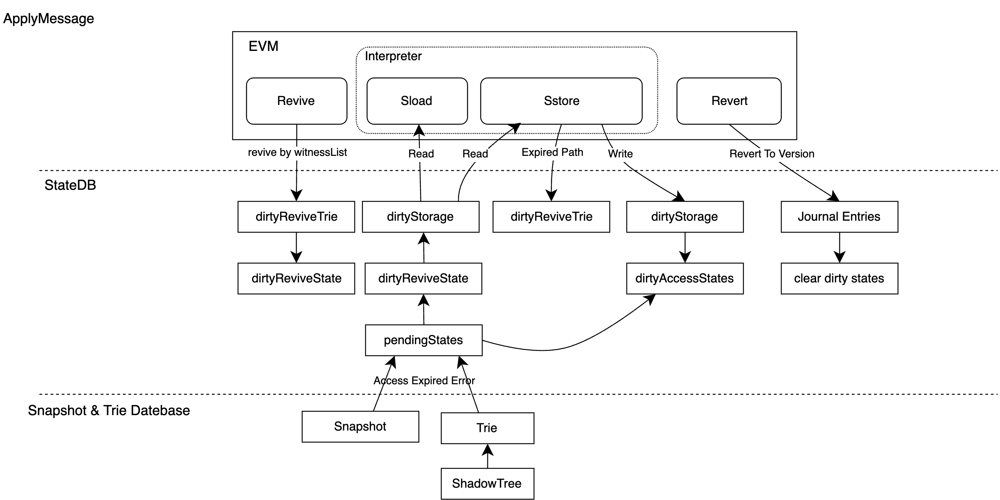
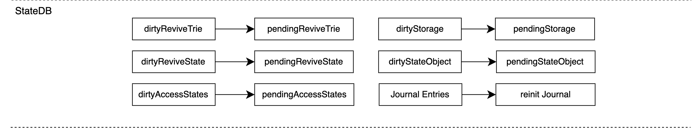
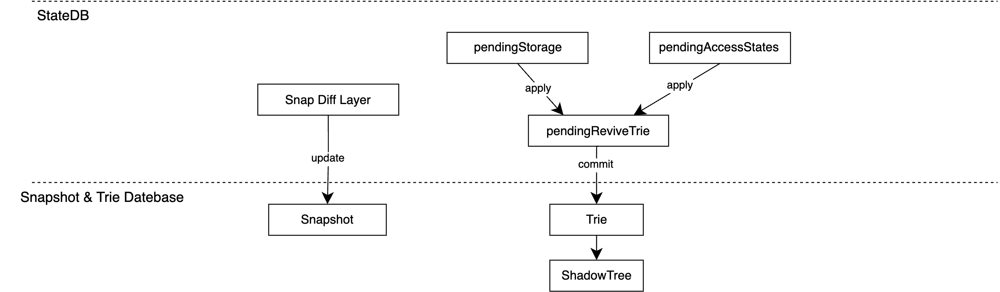

# EVM & StateDB

EVM is mainly related to state operations, mainly including two opcodes, sload and sstore, and interpreter, stateDB and other modules.

The transactions in the block will be executed sequentially. The specific execution process is shown in the figure below:

#### ApplyMessage

When executing a specific transaction, if there is a WitnessList, it will revive the state first. When the execution fails, the revert operation will restore all the states to the version before execution.

  

#### Finalize

When the transaction is successfully executed, all dirty states will be changed to pending state, and subsequent transactions can share all previous changes, but at this time it will not affect the underlying DB.

  

#### Commit

When all transactions in the block are executed and the block meets the submission requirements, such as sync verification or mining seal, all pending states will be submitted to the underlying DB.

