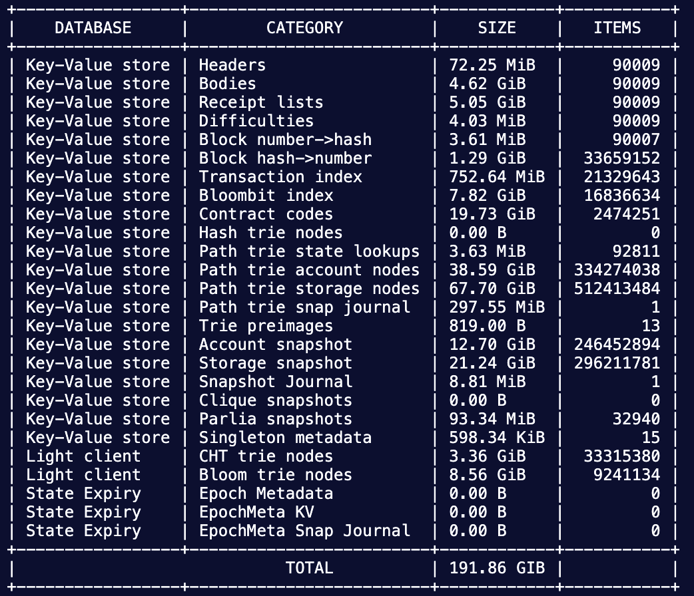
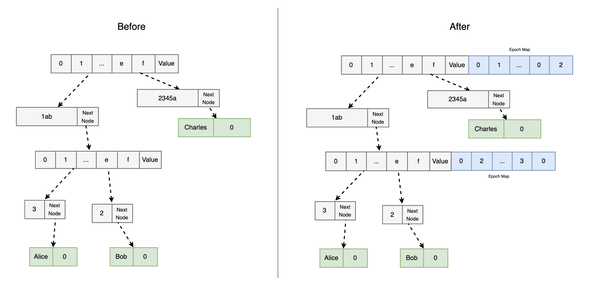
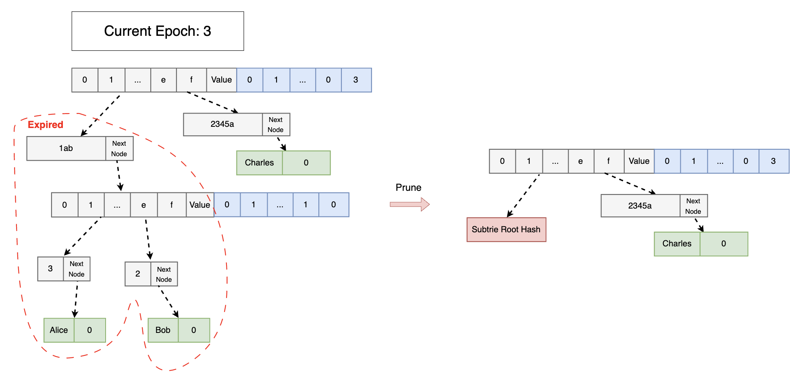
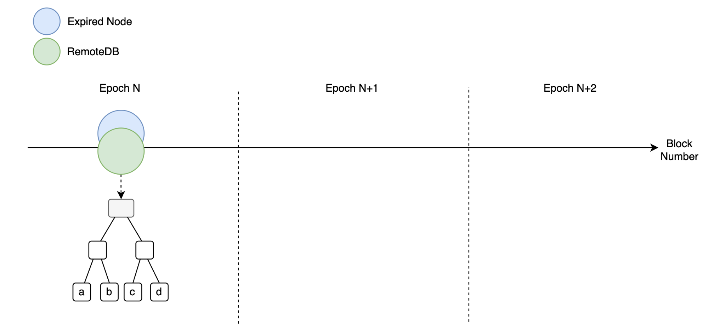
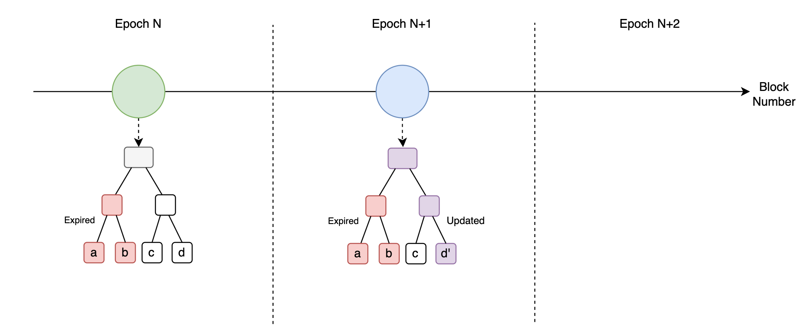
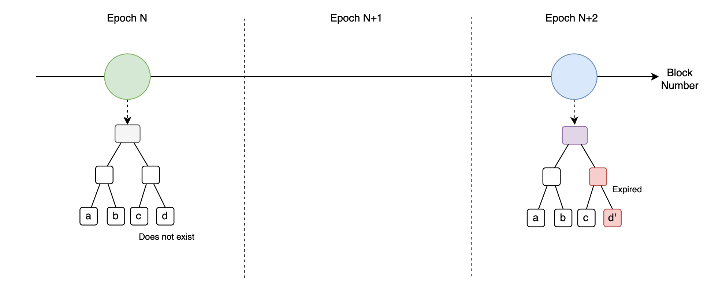
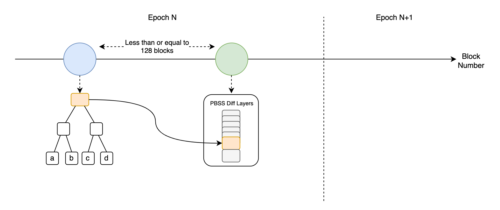
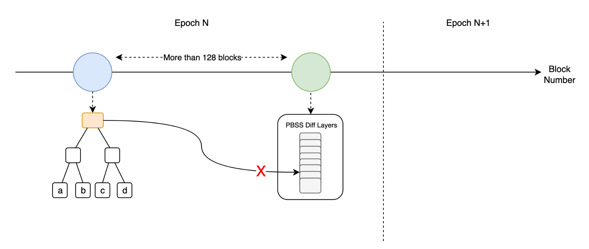
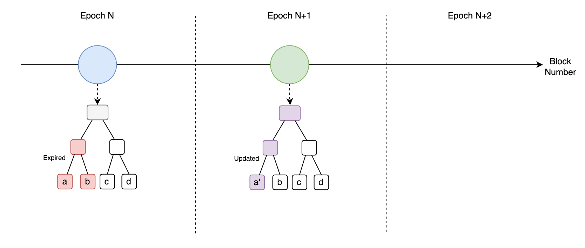
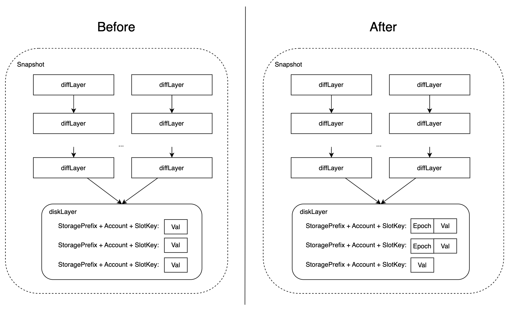

# State Expiry (Non-Consensus)

## 🌟 Introduction
Based on [NodeReal’s BSC Annual Report 2023](https://nodereal.io/blog/en/bnb-smart-chain-annual-storage-report-2023/), running a full node requires minimal storage of 1.6TB. As of November 2023, it already exceeded 2TB. As the state of BSC grows, it gets harder for an average user to run a full node.

With the state growth in mind, our core developers have developed a non-consensus state expiry feature to minimize the state data that BSC full nodes have to store.

## ⚙️ Getting Started
### Environment Setup
#### 1. Create an empty directory
```bash
mkdir state-expiry-node
```

#### 2. Clone the BSC repo on the `state_expiry_mvp0.1_dev` branch
```bash
git clone https://github.com/node-real/bsc --branch state_expiry_mvp0.1_dev bsc-state-expiry
```

#### 3. Compile binary and put the file inside the empty directory that was just created
```bash
cd bsc-state-expiry
make geth
cp build/bin/geth ../state-expiry-node/bsc
```

### Run nodes
In the following example, we will showcase how to run a state-expiry node and a remoteDB using the same machine in the same directory. In the actual use case, users may have a remoteDB that is of another machine.

#### 1. Go into the `state-expiry-node` folder
```bash
cd state-expiry-node
```

#### 2. Download mainnet config
```bash
wget   $(curl -s https://api.github.com/repos/bnb-chain/bsc/releases/latest |grep browser_ |grep mainnet |cut -d\" -f4)
unzip mainnet.zip
```

#### 3. Create two directories, one for state-expiry 
```bash
mkdir node
mkdir remoteDB
```

#### 4. Put the config files in both folders
```bash
cp config.toml node/config.toml
cp genesis.json node/genesis.json
cp config.toml remoteDB/config.toml
cp genesis.json remoteDB/genesis.json
```

#### 5. There are 2 options for syncing
a. Sync from [snapshot](https://github.com/bnb-chain/bsc-snapshots) (recommended)
```
# download snapshot
aria2c -o geth.tar.lz4 -s14 -x14 -k100M <snapshot-url>

# uncompress snapshot in Setup with snapshot
tar -I lz4 -xvf geth.tar.lz4 -C node
tar -I lz4 -xvf geth.tar.lz4 -C remoteDB
```
We highly recommend to choose the snapshot with path-based-state-scheme (PBSS), as the current state expiry version prioritizes the support for it.

b. Sync from genesis
```
./bsc init --datadir node/server/data-seed/ --state.scheme path genesis.json
./bsc init --datadir remoteDB/server/data-seed/ --state.scheme path genesis.json
```

#### 6. Run nodes
```
# Run remoteDB
nohup ./bsc --http --http.addr 0.0.0.0 --config "./remoteDB/config.toml" --rpc.allow-unprotected-txs --allow-insecure-unlock --gcmode full --syncmode full --ws --datadir "remoteDB/server/data-seed/" --metrics --metrics.addr 0.0.0.0 --metrics.port 6061 --pprof --pprof.port 6071 --http.corsdomain "*" --maxpeers 500 --metrics.expensive --history.transactions 0 --state-expiry --state-expiry.epoch1 31246769 --state-expiry.epoch2 32122769 --state-expiry.period 876000 --state-expiry.remotemode > remoteDB/geth-$(date +"%Y%m%d_%H%M").log 2>&1 &

# Run state-expiry node
nohup ./bsc --port 30304 --http --http.port 8503 --ws.port 8547 --config "./node/config.toml" --authrpc.port 8552 --rpc.allow-unprotected-txs --allow-insecure-unlock --gcmode full --syncmode full --state.scheme path --ws --datadir "node/server/data-seed/" --metrics --metrics.addr 0.0.0.0 --metrics.port 6062 --pprof --pprof.port 6072 --http.corsdomain "*" --maxpeers 500 --metrics.expensive --history.transactions 0 --state-expiry --state-expiry.remote http://127.0.0.1:8575 --state-expiry.epoch1 31246769 --state-expiry.epoch2 32122769 --state-expiry.period 876000 --state-expiry.localrevive > node/geth-$(date +"%Y%m%d_%H%M").log 2>&1 &
```

### Flags
- `state-expiry`: Enable state expiry, it will mark the state's epoch meta and prune un-accessed states later
- `state-expiry.remote <rpc-endpoint>`: set state expiry remote full state RPC endpoint, every expired state will fetch from remote
- `state-expiry.epoch1 <block number>`: set state expiry epoch1 block number (i.e. any state access after this block number is marked as epoch 1)
- `state-expiry.epoch2 <block number>`: set state expiry epoch2 block number (i.e. any state access after this block number is marked as epoch 2)
- `state-expiry.period <block number>`: set state expiry epoch period after epoch2
- `state-expiry.localrevive`: if enable local revive
- `state-expiry.maxthread <number>`: set state expiry maxthread in prune
- `state-expiry.remotemode`: set state expiry in remotemode (for remoteDB)

### Pruning
The following command executes an offline prune to remove the expired state from the disk;
```bash
nohup ./bsc snapshot prune-state --config node/config.toml --datadir node/data-seed --state-expiry > node/geth-prune-$(date +"%Y%m%d_%H%M").log 2>&1 &
```

### Run the smallest full node ever
Here is a new way to start up your full node with a pruned expired state full node. It is only 142 GB in size, prunes most expired states, and ancient block/receipt data. The picture below shows its storage detail:

> Note: The actual disk size is less than the storage size, because of the leveldb’s compression algorithm.

Here are the steps to run the smallest BSC full node:
#### 1. Prepare workspace & mainnet config
Follow the steps in the [Run nodes](#run-nodes) section, from step 1 to step 4.

#### 2. Download snapshot and uncompress
```bash
# 1. download pruned bsc snapshot
aria2c -o  geth-pbss-expiry-prune.tar.lz4 -s14 -x14 -k100M https://pub-10cd0733ed3540f1a5bd893cdcaf4027.r2.dev/geth-20231118-pbss-state-expiry-pruned.tar.lz4
tar -I lz4 -xvf geth-pbss-expiry-prune.tar.lz4 -C node
mv node/node/server/ node/

# 2. download normal bsc snapshot, that for remotedb
# Attention: remoteDB's snapshot must behind the expiry prune bsc snapshot
aria2c -o  geth-pbss.tar.lz4 -s14 -x14 -k100M https://pub-c0627345c16f47ab858c9469133073a8.r2.dev/geth-pbss-20231115.tar.lz4
tar -I lz4 -xvf geth-pbss.tar.lz4 -C remoteDB
```

#### 3. Run nodes
```bash
# run remoteDB, using PBSS.
nohup ./bsc --http --http.addr 0.0.0.0 --config "./remoteDB/config.toml" --rpc.allow-unprotected-txs --allow-insecure-unlock --gcmode full --syncmode full --ws --datadir "remoteDB/server/data-seed/" --metrics --metrics.addr 0.0.0.0 --metrics.port 6061 --pprof --pprof.port 6071 --http.corsdomain "*" --maxpeers 500 --metrics.expensive --history.transactions 0 --state-expiry --state-expiry.epoch1 31246769 --state-expiry.epoch2 32122769 --state-expiry.period 876000 --state-expiry.remotemode > remoteDB/geth-$(date +"%Y%m%d_%H%M").log 2>&1 &

# run state expiry node, using PBSS, prune ancient data.
nohup ./bsc --port 30304 --http --http.port 8503 --ws.port 8547 --config "./node/config.toml" --authrpc.port 8552 --rpc.allow-unprotected-txs --allow-insecure-unlock --gcmode full --syncmode full --state.scheme path --ws --datadir "node/server/data-seed/" --metrics --metrics.addr 0.0.0.0 --metrics.port 6062 --pprof --pprof.port 6072 --http.corsdomain "*" --maxpeers 500 --metrics.expensive --history.transactions 90000  --pruneancient --state-expiry --state-expiry.remote http://127.0.0.1:8575 --state-expiry.epoch1 31246769 --state-expiry.epoch2 32122769 --state-expiry.period 876000 --state-expiry.localrevive > node/geth-$(date +"%Y%m%d_%H%M").log 2>&1 &
```
A remoteDB public service may be available in the future so that users only need to run the smallest full node.

## 🌲 Core Concepts
### State epoch metadata
A state epoch is a unit measurement to determine if a state is expired or not. A state epoch period is measured using a fixed number of blocks (e.g. 1 epoch for every 100000 blocks). In our state expiry rule, once a state has been left behind the latest epoch for at least 2 epochs, then it’s considered expired and can be pruned away.

### Trie
#### Expiring only the contract trie
In this state expiry scheme, only the contract tries are affected while the account tries remain unchanged. The rationale behind this is that storage slots have a much bigger proportion as compared to accounts and storage slots grow exponentially quicker than accounts.

#### State epoch in branch nodes
The state epoch metadata is primarily stored in the branch nodes of the contract trie, as shown in the following figure:


The length of the epoch map corresponds to the length of the number of child nodes (i.e. 16), where each epoch points to the direct corresponding child node.

#### State expiry
Every state access operation (i.e. SLOAD and SSTORE) requires the traversal from the root of the contract trie to the value in the leaf node. During the traversal process, it is possible to pass by the branch nodes and have their state epoch checked against the state expiry rule. If it’s expired, then an error is returned and the parent process will perform a state revive operation.

During the offline expired pruning process, each contract trie is scanned and the portion of the expired subtries is evaluated. Expired subtries are pruned, deleting the trie nodes from the database and shrinking the trie. The following figure shows an example:



#### State revive
Upon accessing an expired node, an error message is returned along with the path to the expired node. With this information, state revive can be performed. First, a local revive will be performed. A local revive is simply the operation of refreshing the state epoch of the trie nodes in the situation where expired nodes have not been pruned. This avoids redundant RPC calls to the remoteDB.

If expired trie nodes have been pruned and can no longer be found in the local database, then the state-expiry node must request an MPT proof from a remoteDB (see the next section on remoteDB for more details). Upon receiving the MPT proof, it performs proof verification and inserts back the trie nodes into the trie.

### RemoteDB
RemoteDB plays an important role in this feature. If the remoteDB doesn’t work as expected, the state-expiry node will fail to sync. Any regular full node with the full state can be a remoteDB. Aside from that, an archive node can be a remoteDB as well. The process of requesting an MPT proof is through an RPC call, namely eth_GetStorageReviveProof . Here are the details:

```Go
// Parameters
1. stateRoot, common.Hash - the root hash of the state
2. address, common.Address - the address of the contract
3. root, common.Hash - the root hash of the contract trie
4. storageKeys, []string - list of storage keys
5. storagePrefixKeys, []string - list of storage prefix keys

// Returns
1. reviveResult, ReviveResult - result of the RPC call
2. err, error - error message

type ReviveResult struct {
	Err          string               `json:"err"`
	StorageProof []ReviveStorageProof `json:"storageProof"`
	BlockNum     uint64               `json:"blockNum"`
}

type ReviveStorageProof struct {
	Key       string   `json:"key"`
	PrefixKey string   `json:"prefixKey"`
	Proof     []string `json:"proof"`
}
```

As a state-expiry node requires MPT proof from remoteDB to revive its expired trie, the block heights of these 2 nodes cannot differ too much. If not, the state-expiry node cannot get the valid MPT proof for revive operation, which results in execution failure.

These are the block height coordination cases between the state-expiry node and remoteDB:

#### Case 1: state-expiry node and remoteDB are at the same height


In this case, a state-expiry node can query the proof without any issue as they have the same trie.

#### Case 2: state-expiry node is ahead of remoteDB
- Case 2A: state-expiry node is ahead by < 2 epoch

In this case, the state-expiry node can still query the proof without any issue because if there is an expired portion in the state-expiry node, the same portion will also expire in the remoteDB.

- Case 2B: state-expiry node is ahead by >= 2 epoch

In this case, a state-expiry node is not guaranteed to retrieve valid proof for the expired portion. This is because the expired portion in the state-expiry node may have updated 2 epochs ago and still get expired. Then, the remoteDB's trie doesn't reflect the updated portion.

#### Case 3: state-expiry node is behind remoteDB
In HBSS, as long as the remoteDB is not pruned, it can provide valid MPT proof.

For PBSS, these are the cases:
- Case 3A: state-expiry node is behind by <= PBSS diff depth (assuming the diff depth is 128)
 
In this case, it is still possible for the state-expiry node to retrieve valid proof for the expired portion as the contract root exists in PBSS's diff layers.

- Case 3B: state-expiry node is behind by > PBSS diff depth  

In this case, the state-expiry node can't retrieve valid proof for the expired portion as the contract root no longer exists in the disk.

- Case 3C: state-expiry node is behind by >= 1 epoch  
  
In this case, it is not guaranteed that the state-expiry node can retrieve the valid proof for the expired portion of the trie. This is because the remoteDB's trie could be updated, so the root hash no longer matches.

When doing sync in our testing environment, the state-expiry node is always behind remoteDB as it has degraded performance. Hence, we always need to ensure that the state-expiry node doesn't fall behind too much. To achieve this, we developed a temporary feature for remoteDB to delay its sync by at most 1 epoch. This ensures that the state-expiry node can always get valid proof to perform trie revive.

### Snapshot
As state epoch metadata is introduced to the Trie layer, the snapshot layer (i.e. flattened key-value store) is modified to accommodate the new changes as well. The following figure shows the difference between the old snapshot and the new snapshot layer:


For faster state epoch access, the key-value pair in the snapshot layer is modified to include the state epoch metadata. An additional RLP-encoding and decoding process is added before inserting the key-value pair to accommodate this new format. 

## 📖 Related Work
The development team has previously published a consensus version of the state expiry. Check out the **consensus-state-expiry** folder for more details.

## 🔮 Future Improvements
More work needs to be done to optimize the performance of retrieving proof from remoteDB, (de)serialization, trie prefetch, pruning, and more.

The current version is designed to minimize the storage requirements of a full node as much as possible. We encourage the developers to try this feature out and provide feedback by submitting pull requests to the [NodeReal's BSC repository](https://github.com/node-real/bsc).