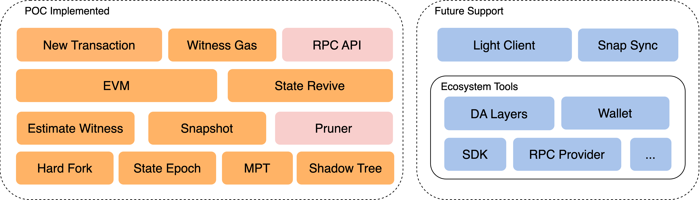
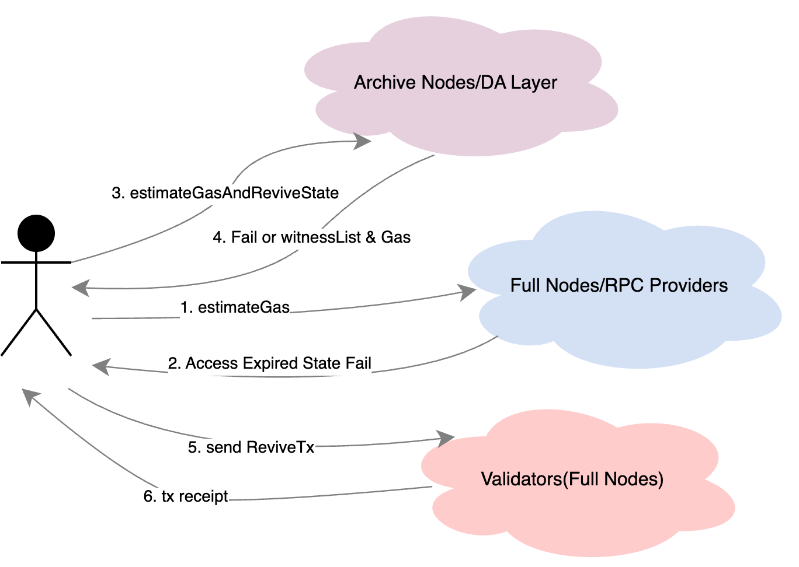

# POC Progress

The current State Expiry solution based on BEP206 and BEP215 has been implemented and open sourced, but it is only a POC, not a complete implementation. Of course, the solution may continue to iterate.

### Related Modules & Consideration

### POC Demo Show

Here is a very simplified interaction diagram about state expiration, but the actual scenarios will be much more complicated.
  

1. Archive Nodes/DA Layer, keep all epoch history;
2. Full Nodes/RPC Provider, only keep latest epoch states;
3. Validators(Full Nodes), package txs, proposal block, only keep latest epoch states;

  

Here is the DevNet is built to simulate state expiry transactions and some scenarios. It is built using the [state-expiry-poc](https://github.com/node-real/state-expiry-poc/) repository.

## Summary

After POC verification, it can be found that BEP-206 and BEP-215 are a feasible solution. The client fully supports execution, expiration, prune, and witness generation on the implementation side. It can fully satisfy the requirements of state expiry.

  

But a lot of work is still needed in the POC:

1. There are many modules involved, requiring a lot of work in implementation and testing;
2. The ecosystem needs to adapt to new APIs, error codes and new transaction types;
3. Need to invite ecological co-construction, such as SDK, LightClient, etc.;
4. The impact on ecology and users needs further evaluation; 

  

For the solution itself, the witness size and the additional storage cost for ArchiveNode are points that need to be further optimized, and there are some things to explore:

1. The introduction of Verkle Tree further reduces the witness size, the computational complexity is high, may tested in practice.;
2. Optimize the additional storage cost, or use a lower-cost decentralized DA Layer solution, such as GreenField;