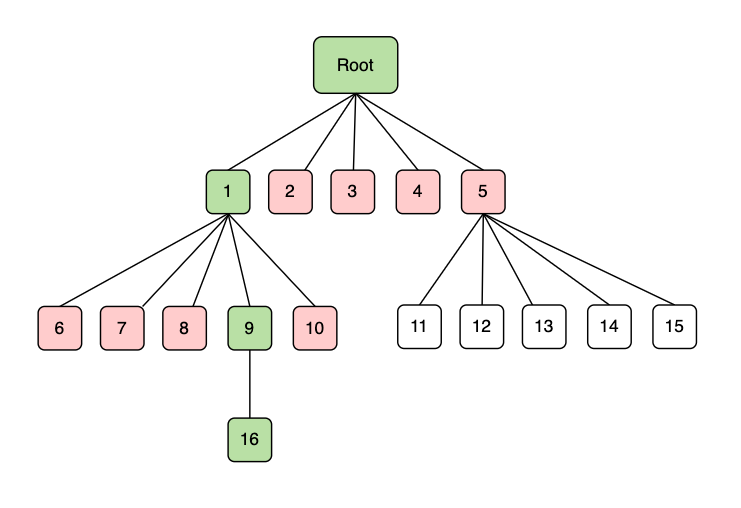

# Verkle Tree

### What is a Verkle Tree?

Verkle Tries are similar to Merkle Trees, which are currently employed as data structures in Ethereum. Verkle Tries share a tree-like structure with Merkle Trees but differ in that each node in Verkle Tries utilizes a unique form of hash referred to as a vector commitment.

  

### Why do we need a Verkle Tree?

Let's look at Merkle Tree:



In this example, we are trying to construct a Merkle proof for the value "16". To do this, we need to construct a proof which contains all red-marked nodes in the figure. As the Merkle Tree goes wider and deeper, the proof size will also increase.

  

Let's look at Verkle Tree:


In Verkle Tree, each node holds a proof called vector commitment. The proof is able to show that a particular node exists in its parent node. For example, "_π19_" is the proof that "kv" exists in "c1". With this, constructing a Verkle proof is as simple as aggregating the path from the root node to the value node. The primary difference between Verkle proof and Merkle proof is that Verkle proof does not require the sister nodes at each level, reducing the overall witness size.

  

Hence, the best advantage of using a Verkle Tree is that vector commitment has a smaller witness size as compared to the Merkle Proof used in Ethereum. Smaller witness size allows witnesses to be stored in a block and supports the feature of statelessness.  

### Verkle Tree vs MPT Comparison

The development team ran an experiment to compare MPT and Verkle Tree in various factors.

  

**4 Key-Value Pairs**

```plain
=== RUN   TestSimpleVerkleTree
+-------+--------------+----------+-------+
| LEVEL | INTERNALNODE | LEAFNODE | VALUE |
+-------+--------------+----------+-------+
|     0 |            1 |        0 |     0 |
|     1 |            1 |        0 |     0 |
|     2 |            1 |        2 |     2 |
|     3 |            0 |        2 |     2 |
+-------+--------------+----------+-------+
key: a711355fffffffffffffffffffffffffffffffffffffffffffffffffffffffff level: 2 proof: 673
key: a77d337fffffffffffffffffffffffffffffffffffffffffffffffffffffffff level: 3 proof: 705
key: a7f9365fffffffffffffffffffffffffffffffffffffffffffffffffffffffff level: 2 proof: 673
key: a77d397fffffffffffffffffffffffffffffffffffffffffffffffffffffffff level: 3 proof: 705
trieStorageSize: 1155
--- PASS: TestSimpleVerkleTree (1.26s)

no precomp, cost 32s.

=== RUN   TestSimpleMerkleTree
+-------+----------+-----------+-------+
| LEVEL | FULLNODE | SHORTNODE | VALUE |
+-------+----------+-----------+-------+
|     0 |        0 |         1 |     0 |
|     1 |        1 |         0 |     0 |
|     2 |        0 |         3 |     2 |
|     3 |        1 |         0 |     0 |
|     4 |        0 |         2 |     2 |
+-------+----------+-----------+-------+
key: a711355fffffffffffffffffffffffffffffffffffffffffffffffffffffffff level: 2 proof: 315
key: a77d337fffffffffffffffffffffffffffffffffffffffffffffffffffffffff level: 4 proof: 498
key: a7f9365fffffffffffffffffffffffffffffffffffffffffffffffffffffffff level: 2 proof: 315
key: a77d397fffffffffffffffffffffffffffffffffffffffffffffffffffffffff level: 4 proof: 498
trieStorageSize: 696
--- PASS: TestSimpleMerkleTree (0.00s)
```

  

**Sparse Tree**

```plain
=== RUN   TestSparseMerkleTree
+-------+----------+-----------+-------+
| LEVEL | FULLNODE | SHORTNODE | VALUE |
+-------+----------+-----------+-------+
|     0 |        1 |         0 |     0 |
|     1 |        1 |         1 |     0 |
|     2 |        2 |         1 |     1 |
|     3 |        1 |         3 |     3 |
|     4 |        0 |         2 |     1 |
|     5 |        1 |         0 |     0 |
|     6 |        1 |         1 |     1 |
|     7 |        0 |         2 |     2 |
+-------+----------+-----------+-------+
key: 1010d0ceffffffffffffffffffffffffffffffffffffffffffffffffffffffff level: 6 proof: 740
key: 1010df2affffffffffffffffffffffffffffffffffffffffffffffffffffffff level: 7 proof: 854
key: 1010dfecffffffffffffffffffffffffffffffffffffffffffffffffffffffff level: 7 proof: 854
key: 101ea21effffffffffffffffffffffffffffffffffffffffffffffffffffffff level: 4 proof: 559
key: 10e21aefffffffffffffffffffffffffffffffffffffffffffffffffffffffff level: 3 proof: 444
key: 1dac20efffffffffffffffffffffffffffffffffffffffffffffffffffffffff level: 2 proof: 330
key: e141acefffffffffffffffffffffffffffffffffffffffffffffffffffffffff level: 3 proof: 396
key: e107efefffffffffffffffffffffffffffffffffffffffffffffffffffffffff level: 3 proof: 396
trieStorageSize: 1727
--- PASS: TestSparseMerkleTree (0.00s)


=== RUN   TestSparseVerkleTree
+-------+--------------+----------+-------+
| LEVEL | INTERNALNODE | LEAFNODE | VALUE |
+-------+--------------+----------+-------+
|     0 |            1 |        0 |     0 |
|     1 |            2 |        0 |     0 |
|     2 |            1 |        3 |     3 |
|     3 |            2 |        0 |     0 |
|     4 |            1 |        3 |     3 |
|     5 |            2 |        0 |     0 |
|     6 |            1 |        2 |     2 |
|     7 |            0 |        3 |     3 |
+-------+--------------+----------+-------+
key: 010001011232e3e1ffffffffffffffffffffffffffffffffffffffffffffffff level: 4 proof: 737
key: 010001fd0102a1b1ffffffffffffffffffffffffffffffffffffffffffffffff level: 7 proof: 833
key: 010001fd010201a2ffffffffffffffffffffffffffffffffffffffffffffffff level: 7 proof: 833
key: 010001fd0102fde1ffffffffffffffffffffffffffffffffffffffffffffffff level: 7 proof: 833
key: 010001fdfdfda2b2ffffffffffffffffffffffffffffffffffffffffffffffff level: 6 proof: 801
key: 010001fdfdffb3d3ffffffffffffffffffffffffffffffffffffffffffffffff level: 6 proof: 801
key: 0100fe01a432e3e1ffffffffffffffffffffffffffffffffffffffffffffffff level: 4 proof: 737
key: 0100fefd1232e3efffffffffffffffffffffffffffffffffffffffffffffffff level: 4 proof: 737
key: 01ffcabfa432e3e1ffffffffffffffffffffffffffffffffffffffffffffffff level: 2 proof: 673
key: fe011abfb432e3e1ffffffffffffffffffffffffffffffffffffffffffffffff level: 2 proof: 673
key: fefd1abfa43ee3e1ffffffffffffffffffffffffffffffffffffffffffffffff level: 2 proof: 673
trieStorageSize: 3402
--- PASS: TestSparseVerkleTree (1.55s)
```

  

**1000 Key-Value Pairs**

```plain
=== RUN   TestRandomVerkleTree
generated 1000 kv
+-------+--------------+----------+-------+
| LEVEL | INTERNALNODE | LEAFNODE | VALUE |
+-------+--------------+----------+-------+
|     0 |            1 |        0 |     0 |
|     1 |          235 |       17 |    17 |
|     2 |           10 |      963 |   963 |
|     3 |            0 |       20 |    20 |
+-------+--------------+----------+-------+
key: 90dc0913ec6e8c0f3a5856bea4367079b774a2dbed783a1e06ca534e0f639f7a level: 2 proof: 673
key: 2e7a3fb3cdc48b0f0311cc99d4d0b1d6d24dabb4951a07f5e24792e69936a26c level: 1 proof: 641
trieStorageSize: 247830
--- PASS: TestRandomVerkleTree (39.36s)
PASS
ok  	github.com/gballet/go-verkle	39.832s

=== RUN   TestRandomMerkleTree
generated 1000 kv...
+-------+----------+-----------+-------+
| LEVEL | FULLNODE | SHORTNODE | VALUE |
+-------+----------+-----------+-------+
|     0 |        1 |         0 |     0 |
|     1 |       16 |         0 |     0 |
|     2 |      233 |        22 |    21 |
|     3 |       91 |       774 |   761 |
|     4 |       13 |       191 |   190 |
|     5 |        1 |        26 |    26 |
|     6 |        0 |         2 |     2 |
+-------+----------+-----------+-------+
key: 3a21ecd9cdd9c680984ef13d130383e7cc34e131f3124159a5bb423a821cae60 level: 3 proof: 1502
key: 9abb84d165545797b6c75a3f36c4ce0ce6a9e53b12c5f31146e9444f86c67f9f level: 2 proof: 1228
key: 5f4763400810dd2c4b8f2a24c2bf0dfc3f25ee3b4e55833265a6f168e12dbebd level: 4 proof: 1585
key: e78a9635c39a8e755edfa54353f3f53a0aa53b9611dc84f9984c61429eec4c74 level: 5 proof: 1555
trieStorageSize: 161454
--- PASS: TestRandomMerkleTree (1.10s)
PASS
ok  	github.com/ethereum/go-ethereum/trie	1.566s
```

  

**10000 Key-Value Pairs**

```plain
=== RUN   TestRandomMerkleTree
generated 10000 kv...
+-------+----------+-----------+-------+
| LEVEL | FULLNODE | SHORTNODE | VALUE |
+-------+----------+-----------+-------+
|     0 |        1 |         0 |     0 |
|     1 |       16 |         0 |     0 |
|     2 |      256 |         0 |     0 |
|     3 |     2813 |       918 |   856 |
|     4 |      644 |      7773 |  7731 |
|     5 |       51 |      1310 |  1309 |
|     6 |        1 |       102 |   102 |
|     7 |        0 |         2 |     2 |
+-------+----------+-----------+-------+
key: 879e503694d1ebad5ff541635b4b8d7888766bc1b60057c027035c095a751c81 level: 4 proof: 1938
key: 13ed61fa6de561c8a703edd06d6bf6f30bb1bd38495a91723a4d56953e863051 level: 5 proof: 2020
key: 26ff44c2c4ea5100cade0f491bb70d4b1232a01758d9656b6e34bb583d3a56b8 level: 3 proof: 1791
key: d9ab6804189a025c7bd0265e11523c9a93c6f3b463742d4da92b2642ab3b56d8 level: 6 proof: 2151
trieStorageSize: 1629778
--- PASS: TestRandomMerkleTree (5.02s)

=== RUN   TestRandomVerkleTree
generated 10000 kv
+-------+--------------+----------+-------+
| LEVEL | INTERNALNODE | LEAFNODE | VALUE |
+-------+--------------+----------+-------+
|     0 |            1 |        0 |     0 |
|     1 |          256 |        0 |     0 |
|     2 |          697 |     8577 |  8577 |
|     3 |            1 |     1421 |  1421 |
|     4 |            0 |        2 |     2 |
+-------+--------------+----------+-------+
key: 4c051175bb4dc07a50244b2aba87a8a63ab6896d2fbc77bb7ecaeb1dd5dee410 level: 2 proof: 673
key: a0e1f50d63dc4ab811ef9bbdfeb416ef83c1b563a9cd4d386890a010d40e2f94 level: 3 proof: 705
key: 0feca3df7a550c415bec203c343230902969af8c778ceed3136b7a0b0b016246 level: 4 proof: 737
trieStorageSize: 2332603
--- PASS: TestRandomVerkleTree (12.95s)
```

  

The following table details the comparison between MPT and Verkle Tree:

  

|  | MPT | Verkle Tree |
| ---| ---| --- |
| Storage Size | Smaller | Larger, requires 40%～50% more storage space than MPT |
| Proof Generation Time | Faster | 20x slower |
| Proof size | Large, it's only small when the tree is sparse | Smaller and varies by only 32 bytes as the depth of the tree increases |

  

Based on the results, we can conclude that Verkle Tree takes up more storage size, has a slower proof generation time and smaller proof size as compared to the MPT.

